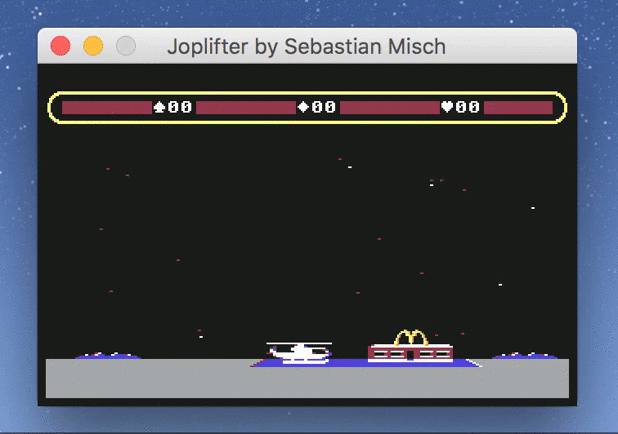

# c64-choplifter-clone
A pixel-perfect Commodore-64 choplifter clone written in Java
AWT - 25 years after the original game came out on C64.

This is a fun project I've done back in 2007 - a present for Dan
Gorlin & Dane Bigham - who wrote *choplifter* 25 years before
(in 1982!!).



## Play it, play it, play it now!!!

Hell ya, this is oldschool. To compile install `ant` and run:

```
$ ant dist
```

To run type:

```
$ java -jar dist/joplifter.jar
```

If the game appears too small on your screen, you can add the
`sun.java2d.uiScale` to scale it up. To run at 4x size:

```
java -Dsun.java2d.uiScale=4 -jar dist/joplifter.jar
```

Use the *ARROW* keys to navigate. Longpress *SPACE* to turn the
helicopter around. Hit *SPACE* shortly to shoot.

Collect up to ten humans at once and bring them back to the
home base.
They are hungry!
